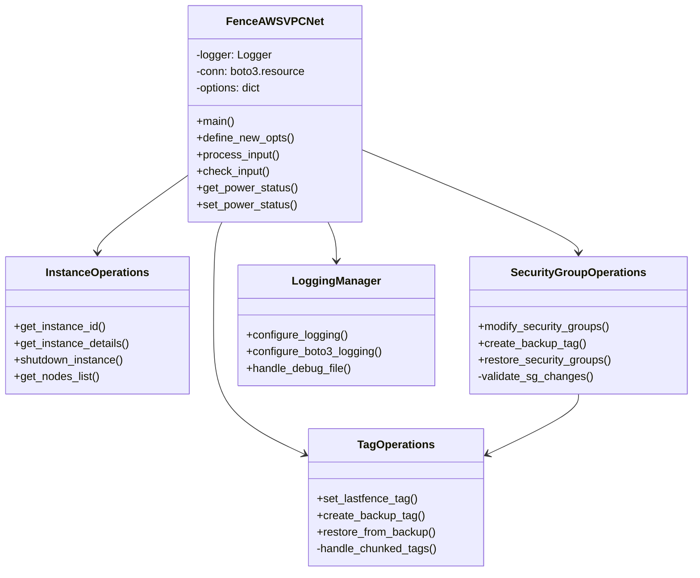
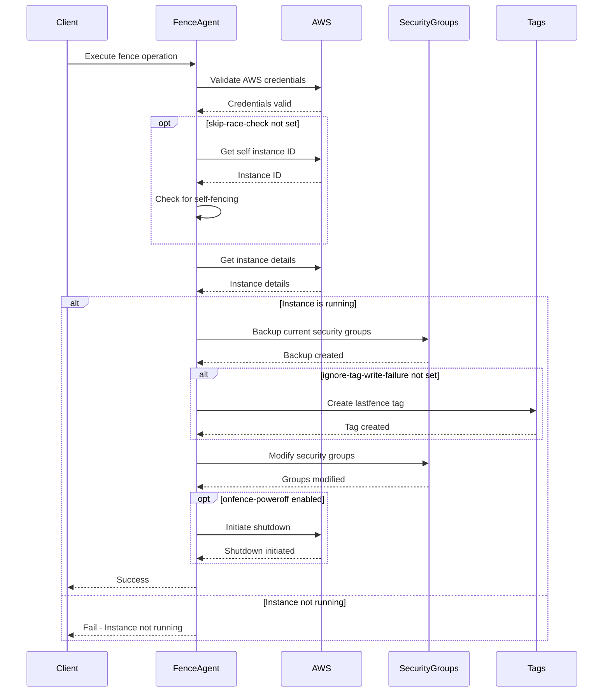
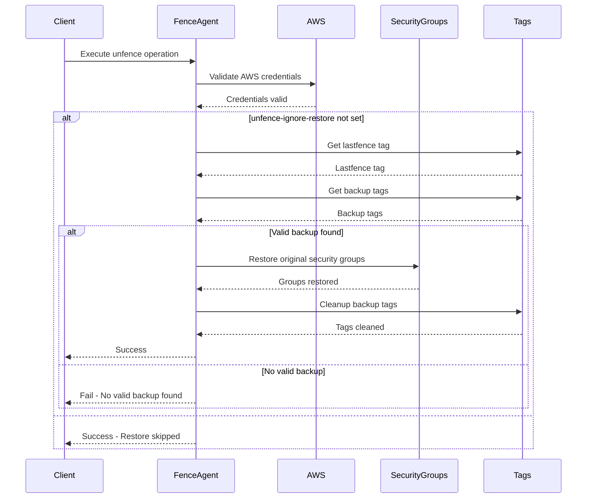

# Fence AWS VPC Network Agent Design Document

## Overview

The fence_aws_vpc_net agent is a network and power fencing agent for AWS VPC that operates by manipulating security groups. This document outlines the design and architecture of the agent.

## Class Diagram



## Sequence Diagrams

### Fence Operation (Power Off)



### Unfence Operation (Power On)



## Component Details

### 1. Main Controller (FenceAWSVPCNet)
- **Purpose**: Main entry point and orchestration
- **Key Responsibilities**:
  - Process command line options
  - Initialize AWS connection
  - Execute fence operations
  - Handle logging and errors
  - Manage self-fencing prevention
  - Support tag write failure handling

### 2. Instance Operations
- **Purpose**: Handle EC2 instance operations
- **Key Responsibilities**:
  - Get instance details and metadata
  - Handle instance power operations
  - Validate instance states
  - List and filter instances
  - Handle instance shutdown

### 3. Security Group Operations
- **Purpose**: Manage security group operations
- **Key Responsibilities**:
  - Modify security groups (remove or keep-only modes)
  - Handle chunked backup operations
  - Restore security groups from backups
  - Validate security group changes
  - Support partial success scenarios

### 4. Tag Operations
- **Purpose**: Manage AWS resource tagging
- **Key Responsibilities**:
  - Create and manage backup tags
  - Handle chunked tag data
  - Manage lastfence tags
  - Clean up tags after operations
  - Support tag write failure scenarios

### 5. Logging Manager
- **Purpose**: Handle logging configuration
- **Key Responsibilities**:
  - Configure application logging
  - Manage boto3 debug logging
  - Handle debug file output
  - Control log propagation

## Success and Failure Paths

### Success Paths

1. **Normal Fence Operation**
```
Start
├── Validate AWS credentials
├── Check for self-fencing (if enabled)
├── Check instance is running
├── Backup security groups (with chunking)
├── Create lastfence tag (if tag writes enabled)
├── Modify security groups
├── [Optional] Shutdown instance
└── Success
```

2. **Normal Unfence Operation**
```
Start
├── Validate AWS credentials
├── [Skip if unfence-ignore-restore]
│   ├── Find lastfence tag
│   ├── Find backup tags
│   ├── Restore security groups
│   └── Clean up tags
└── Success
```

### Failure Paths

1. **Authentication Failures**
```
Start
├── Invalid AWS credentials
└── Fail with auth error
```

2. **Instance State Failures**
```
Start
├── Instance not in required state
└── Fail with state error
```

3. **Security Group Operation Failures**
```
Start
├── Backup creation fails
│   ├── [If ignore-tag-write-failure]
│   │   └── Continue with SG modifications
│   └── [Otherwise]
│       └── Fail with backup error
├── Security group modification fails
│   └── Fail with modification error
└── Restoration fails
    └── Fail with restore error
```

4. **Tag Operation Failures**
```
Start
├── Tag creation fails
│   ├── [If ignore-tag-write-failure]
│   │   └── Continue operation
│   └── [Otherwise]
│       └── Fail with tag error
├── Tag retrieval fails
│   └── Fail with retrieval error
└── Tag cleanup fails
    └── Warning (non-fatal)
```

## Error Handling

### Error Categories
1. **AWS API Errors**
   - ConnectionError
   - ClientError
   - EndpointConnectionError
   - NoRegionError
   - Tag size limitations
   - API rate limiting

2. **Validation Errors**
   - Invalid parameters
   - Missing required options
   - Invalid security group configurations
   - Malformed tag data

3. **State Errors**
   - Instance state conflicts
   - Security group conflicts
   - Self-fencing detection
   - Partial operation completion

### Error Recovery
- Automatic retries for transient AWS API errors
- Chunked tag handling for large security group lists
- Support for continuing operation despite tag failures
- Rollback of security group changes on partial failures
- Preservation of backup tags for manual recovery
- Detailed logging for troubleshooting

## Configuration Options

### Required Options
- `--plug`: AWS Instance ID
- AWS credentials (via options or environment)

### Optional Options
- `--region`: AWS region
- `--access-key`: AWS access key
- `--secret-key`: AWS secret key
- `--secg`: Security groups to remove/keep
- `--skip-race-check`: Skip self-fencing check
- `--invert-sg-removal`: Keep only specified security groups
- `--unfence-ignore-restore`: Skip restore on unfence
- `--onfence-poweroff`: Power off on fence
- `--ignore-tag-write-failure`: Continue despite tag failures
- `--filter`: Filter instances for list operation
- `--boto3_debug`: Enable boto3 debug logging

## Logging and Monitoring

### Log Levels
- ERROR: Operation failures and AWS API errors
- WARNING: Non-critical issues and tag operation failures
- INFO: Operation progress and success
- DEBUG: Detailed operation data and API responses

### Key Metrics
- Operation success/failure rates
- Tag operation success rates
- Security group modification status
- AWS API call latency
- Error frequency and types
- Tag size and chunking metrics

## Security Considerations

### Authentication
- AWS credential management
- IAM role requirements
- Access key security
- Instance metadata security

### Operation Safety
- Self-fencing prevention
- Backup verification
- Security group validation
- State verification
- Tag operation integrity
- Partial success handling

## Best Practices

1. **Operation Safety**
   - Always verify instance state
   - Use self-fencing prevention
   - Validate security group changes
   - Maintain accurate backups
   - Handle tag operation failures gracefully

2. **Error Handling**
   - Implement proper rollbacks
   - Use chunked tag operations
   - Maintain detailed logs
   - Preserve recovery data
   - Handle edge cases
   - Support partial success scenarios

3. **Performance**
   - Minimize API calls
   - Implement retries
   - Handle rate limiting
   - Optimize tag operations
   - Use efficient security group modifications

4. **Maintenance**
   - Regular backup cleanup
   - Log rotation
   - Configuration updates
   - Security updates
   - Monitor tag usage
   - Clean up orphaned tags
